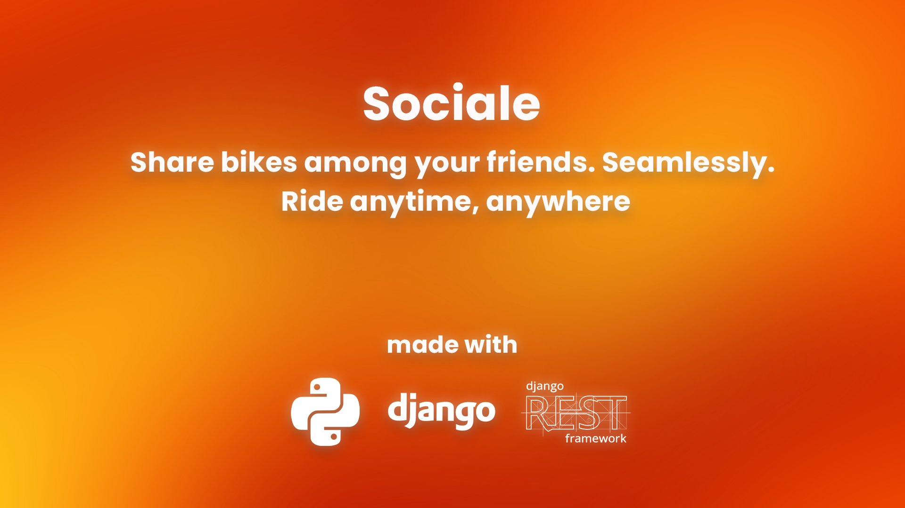

<h3  id="readme-top" align="center">Sociale</h3>
<p align="center">
    Seamless real-time bike rental management
    <br />
    <a href="https://github.com/AntoniPokrzywa/Sociale/tree/main/docs"><strong>Explore the docs »</strong></a>
    <br />
    <br />
    <a href="sociale.me">View Demo</a>
    ·
    <a href="https://github.com/AntoniPokrzywa/Sociale/issues/new?labels=bug&template=bug-report---.md">Report Bug</a>
    ·
    <a href="https://github.com/AntoniPokrzywa/Sociale/issues/new?labels=enhancement&template=feature-request---.md">Request Feature</a>
  </p>
  
  
<!-- GETTING STARTED -->
## Getting Started

This is an example of how you may give instructions on setting up your project locally.
To get a local copy up and running follow these simple example steps.

### Prerequisites

Make sure Docker is installed. You can download it from [here](https://www.docker.com/get-started).
```sh
docker --version
```

### Installation

1. **Clone the repository**  
   First, clone the repository:
   ```bash
   git clone https://github.com/antonipokrzywa/sociale
   cd https://github.com/antonipokrzywa/sociale

2. **Set up environment variables**  
   Ensure the `.env` file is present and properly configured with the correct database credentials, if you are planning to add password reset functionality make sure to include it too

3. **Set up the Docker container**  
   Build and start the Docker containers:
   ```bash
   docker compose up --build
   ```

4. **Access the app**  
   Once the containers are up, the app will be available at:
   ```bash
   http://localhost:8000
   ```

<p align="right">(<a href="#readme-top">back to top</a>)</p>

## Further steps

TODO add some cool webap photos and provice link


<p align="right">(<a href="#readme-top">back to top</a>)</p>


## License

Distributed under the MIT License. See `LICENSE.txt` for more information.


<!-- CONTACT -->
## Contact

Antoni Pokrzywa - [/in/antonipokrzywa/](https://www.linkedin.com/in/antonipokrzywa/) - antonipokrzywa@gmail.com

Project Link: [https://github.com/AntoniPokrzywa/Sociale](https://github.com/AntoniPokrzywa/Sociale)

<p align="right">(<a href="#readme-top">back to top</a>)</p>